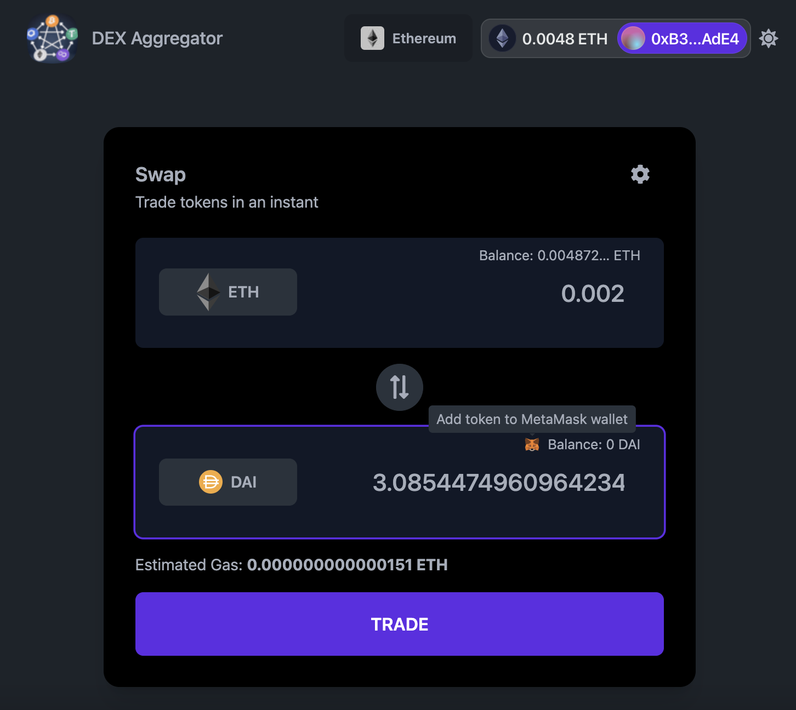

# DEX Aggregator

<p align="center">
  
</p>

This app aggregates liquidity across the greater DEX ecosystem and surfaces the best price to the user using the [0x](https://0x.org/docs) swap API.

Latest deployment: https://simple-dex-aggregator.vercel.app

<p align="center">
  
</p>

### Features

1. Dark and light theme
2. Support for small screens
3. Over [4000 ERC20 tokens](https://tokenlists.org/token-list?url=https://tokens.coingecko.com/uniswap/all.json)
4. Adding token to the wallet with one click
5. Best possible price from multiple liquidity sources

### TODOs
1. Support for multiple chains other than Ethereum mainnet

## Developing

Once you've created a project and installed dependencies with `npm install` (or `pnpm install` or `yarn`), start a development server:

```bash
npm run dev

# or start the server and open the app in a new browser tab
npm run dev -- --open
```

## Building

To create a production version of your app:

```bash
npm run build
```

You can preview the production build with `npm run preview`.

> To deploy your app, you may need to install an [adapter](https://kit.svelte.dev/docs/adapters) for your target environment.
